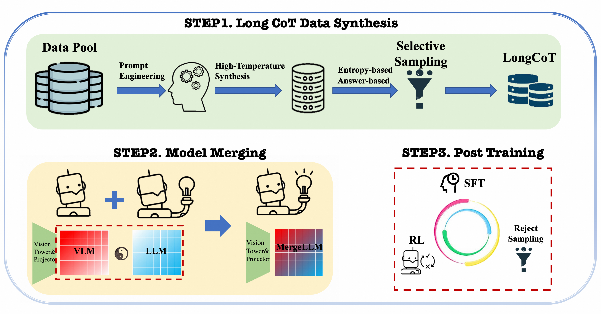
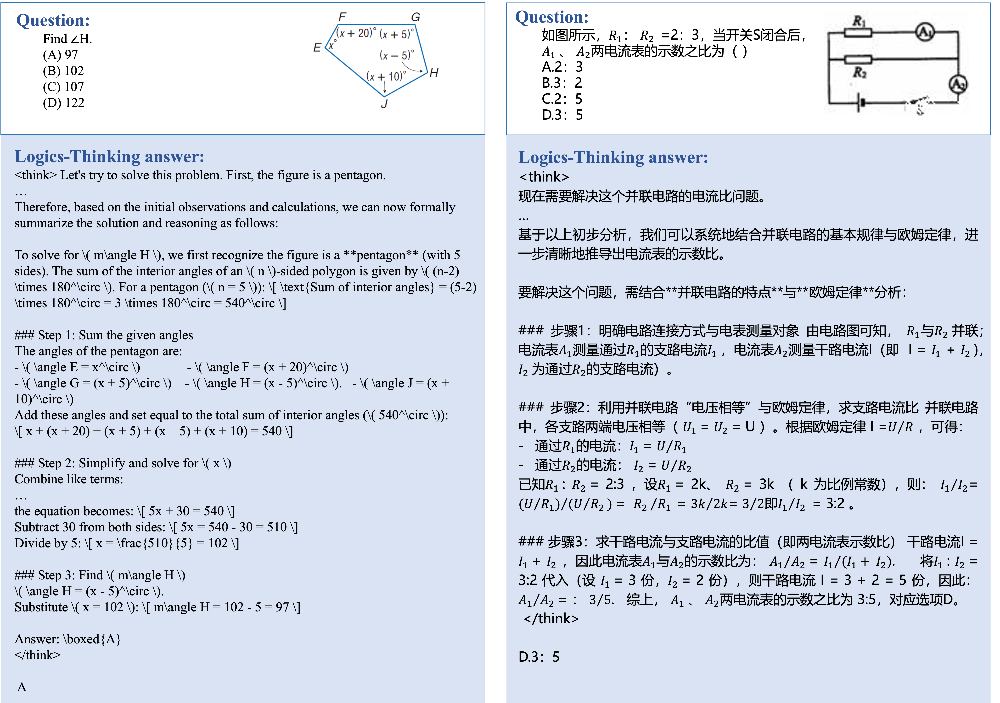

# Logics-Thinking

<div align="center">
  
</div>

<font size=7><div align='center' >   [[📊 Models](https://huggingface.co/Logics-MLLM/Logics-Thinking)] </div></font>


## 🔥 News

We are honored to launch **Logics-Thinking**, a next-generation multimodal large model developed with great dedication by the **Logics Team** at Alibaba Group. Logics-Thinking is specifically engineered for advanced reasoning tasks, demonstrating outstanding performance in the domain of complex logical and abstract reasoning. This launch marks a key step in our mission to continuously push the frontiers of artificial intelligence, and we are excited for the future it will enable.


<div align="center">
  
</div>

The Logics-Thinking training pipeline comprises three key steps: (1) Long CoT Data Synthesis, which involves Prompt Engineering and Selective Sampling; (2) Model Merging and (3) Advanced Training, which includes Supervised Fine-Tuning (SFT) and Reinforcement Learning (RL) methods.

## Contents <!-- omit in toc -->
- [🔥 News](#-news)
- [📐 Quick Start](#-quick-start)
- [📈 Experimental Results](#-experimental-results)
- [✒️ Citation](#️-citation)

## 📐 Quick Start
### Install
```bash
pip install -r requirements.txt
```

#### Inference
```python
import torch
from transformers import AutoModelForCausalLM, AutoProcessor

image_base64 = "data:image/png;base64,iVBORw0KGgoAAAANSUhEUgAAAAEAAAABCAQAAAC1HAwCAAAAC0lEQVR42mP8/wcAAwAB/epv2AAAAABJRU5ErkJggg=="
image_url = "http://path/to/your/image.jpg"
image_path = "file:///path/to/your/image.jpg"
video_path = "file:///path/to/video1.mp4"
text="Please describe this image or video."

MODEL_PATH = 'Logics-MLLM/Logics-Thinking'
model = AutoModelForCausalLM.from_pretrained(
    MODEL_PATH,
    torch_dtype="auto",
    device_map="auto", 
    trust_remote_code=True,
)

processor = AutoProcessor.from_pretrained(
    MODEL_PATH,
    trust_remote_code=True,
)

inputs = processor(
    text=text,
    images=image_path,
    return_tensors="pt"
)

generated_ids = model.generate(**inputs)
generated_text = processor.batch_decode(generated_ids, skip_special_tokens=True)[0]

print(generated_text)


```


<div align="center">
  
  <i>Examples of Responses Generated by the Logics-Thinking for Chinese and English Questions.</i>
</div>


## Acknowledgement

Logics is developed based on the codebases of the following projects: [SigLIP](https://huggingface.co/google/siglip-so400m-patch14-384),[ConvNeXT](https://huggingface.co/facebook/convnext-large-224), [Qwen3](https://github.com/QwenLM/Qwen3), [LLaVA-OneVision](https://llava-vl.github.io/blog/2024-08-05-llava-onevision/), [VLMEvalKit](https://github.com/open-compass/VLMEvalKit). We sincerely thank these projects for their outstanding work.

